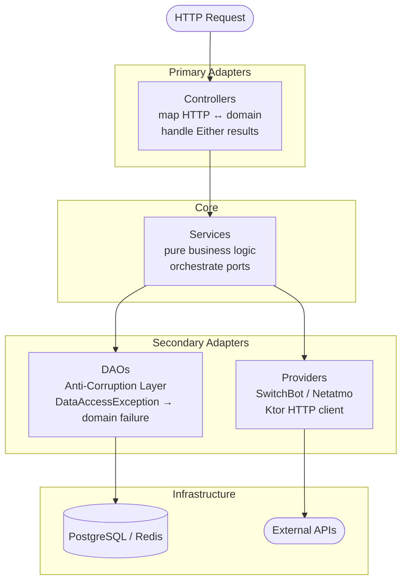

# Architecture Guide — Smart Home API

## Philosophy

The Smart Home API follows a **Pragmatic Hexagonal Architecture** (Ports and Adapters).

The goal is to keep the **core business logic completely isolated** from infrastructure concerns (databases, HTTP frameworks, external APIs). The domain layer has zero knowledge of Spring, JDBC, or Ktor. It depends only on pure Kotlin and [Arrow](https://arrow-kt.io/).

### Error Handling — `Either` over Exceptions

All operations that can fail return `Either<DomainError, Success>`. Exceptions are **never** allowed to propagate into the service or domain layers. They are caught at infrastructure boundaries and converted into typed domain errors.

```kotlin
// DAO implementation — exception is caught here and never leaks upward
override fun save(area: AreaDto): Either<AreaCreationFailure, Unit> = try {
    areasRepo.persist(area).right()
} catch (_: SameNameAreaException) {
    AreaNameConflict.left()
} catch (e: DataAccessException) {
    PersistenceFailure(e).left()
}
```

Domain errors are **sealed interfaces**, organized by operation (e.g. `AreaCreationFailure`, `AreaFetchFailure`). This makes exhaustive `when` matching possible and eliminates implicit error paths.

---

## Layer Overview



---

## Layer Rules

### Controllers — Primary Adapters

Controllers live in `controllers/` and are the only layer allowed to depend on Spring Web (`@RestController`, `ResponseEntity`, etc.).

**Responsibilities:**
- Deserialize HTTP request bodies into plain data objects.
- Delegate all logic to a service.
- Pattern-match the `Either` result and produce the appropriate HTTP response.

```kotlin
when (val result = areasService.createArea(name = request.name)) {
    is Right -> status(CREATED).body(CreatedResourceResponse(...))
    is Left  -> when (result.value) {
        AreaNameConflict   -> badRequest().body(...)
        is PersistenceFailure -> internalServerError().body(...)
    }
}
```

Controllers must contain **no business logic**. They translate; they do not decide.

---

### Services — Core

Services live in `services/` and contain all business logic. They depend only on domain interfaces (DAO ports, `UnitOfWork`). They must never depend on concrete infrastructure classes.

**Responsibilities:**
- Enforce business invariants (e.g. overlapping schedule validation in `HeatingAreasService`).
- Orchestrate multiple DAO calls inside a `UnitOfWork.execute {}` block when atomicity is required.
- Compose `Either` results using Arrow operators (`flatMap`, `map`, etc.).

Services are **not allowed** to use `@Transactional`. Transaction boundaries are declared explicitly via `UnitOfWork`.

---

### DAOs — Secondary Adapters (Anti-Corruption Layer)

DAO interfaces are defined in `persistence/` as pure Kotlin interfaces that return `Either`. JDBC implementations live in `persistence/jdbc/dao/`.

**Responsibilities:**
- Translate between domain types and persistence entities.
- Catch all infrastructure exceptions (`DataAccessException`, etc.) at this boundary and convert them into typed domain failures.
- Never let raw exceptions reach the service layer.

```kotlin
override fun getAreaById(areaId: UUID): Either<AreaFetchFailure, AreaDto> = try {
    areasRepo.findAreaById(areaId)?.asArea()?.right()
        ?: AreaNotFound(missingAreaId = areaId).left()
} catch (e: DataAccessException) {
    PersistenceFailure(e).left()
}
```

Spring Data JDBC repositories are an **internal implementation detail** of the DAO layer and must not be referenced outside of it.

---

### Providers — Secondary Adapters

Providers live in `providers/` and integrate with external device APIs (SwitchBot, Netatmo). They use the Ktor HTTP client and implement the `DevicesProvider` domain port.

**Responsibilities:**
- Communicate with external APIs via Ktor suspend functions.
- Map provider-specific response models to domain `Device` types via a factory.
- Wrap all failures in `Either.Left` using `ProviderFailure`.

---

## Unit of Work Pattern

When a service operation requires **multiple writes** that must succeed or fail together, it uses `UnitOfWork`.

### Port — domain layer

```kotlin
// org.agrfesta.sh.api.domain.UnitOfWork
interface UnitOfWork {
    fun <E, A> execute(block: () -> Either<E, A>): Either<E, A>
}
```

The interface lives in the `domain` package and has no infrastructure dependencies.

### Adapter — infrastructure layer

```kotlin
// org.agrfesta.sh.api.persistence.utils.SpringUnitOfWork
@Component
class SpringUnitOfWork(
    private val transactionTemplate: TransactionTemplate
) : UnitOfWork {
    override fun <E, A> execute(block: () -> Either<E, A>): Either<E, A> {
        return transactionTemplate.execute { status ->
            val result = block()
            if (result is Either.Left) status.setRollbackOnly()
            result
        }!!
    }
}
```

`SpringUnitOfWork` lives in the infrastructure layer and is the only place where Spring's transaction infrastructure is referenced.

### Usage in a service

The idiomatic Arrow style (Arrow 1.2+) uses `either { }` with `bind()` and `raise()` instead of chained `flatMap` calls. This turns nested functional pipelines into readable sequential code.

`UnitOfWork.execute` accepts a plain `() -> Either<E, A>` lambda, so an inner `either { }` block is needed to use `bind()` inside it. The outer `either { }` wraps the full operation and lets `raise()` short-circuit on validation failures.

```kotlin
fun createSetting(setting: AreaTemperatureSetting): Either<TemperatureSettingCreationFailure, Unit> = either {
    if (setting.temperatureSchedule.hasOverlap()) raise(OverlappingIntervals)

    unitOfWork.execute {
        either {
            val exists = temperatureSettingsDao.existsByAreaId(setting.areaId).bind()
            if (exists) temperatureSettingsDao.deleteAreaSetting(setting.areaId).bind()
            temperatureSettingsDao.persistAreaTemperatureSetting(setting).bind()
        }
    }.bind()
}
```

---

## Do's and Don'ts

### DO

- **DO** return `Either<DomainError, T>` from every operation that can fail.
- **DO** use `UnitOfWork.execute {}` when a service method performs two or more writes that must be atomic.
- **DO** catch all infrastructure exceptions inside DAO implementations and convert them to typed domain failures.
- **DO** use sealed interfaces to model domain errors, organized by operation (e.g. `AreaCreationFailure`).
- **DO** keep the `domain` package free of Spring, JDBC, and Ktor imports.
- **DO** inject DAO and provider **interfaces** (ports) into services — never concrete implementations.
- **DO** use Arrow operators (`flatMap`, `map`, `recover`) to chain `Either` results inside services.
- **DO** use value objects (`Temperature`, `Percentage`, `RelativeHumidity`) for domain quantities — never raw `Double` or `Float`.

### DON'T

- **DON'T** annotate service methods with `@Transactional`. Transaction boundaries belong to `UnitOfWork`.
- **DON'T** let exceptions propagate beyond the DAO layer.
- **DON'T** reference Spring Data JDBC repositories outside of `persistence/jdbc/`.
- **DON'T** put business logic in controllers. They translate; they do not decide.
- **DON'T** use raw `Double` or `Float` for domain values. Use the typed value classes.
- **DON'T** add new infrastructure imports to the `domain` package.
- **DON'T** use `Either.getOrElse` or force-unwrap results in the service layer to avoid handling errors.
