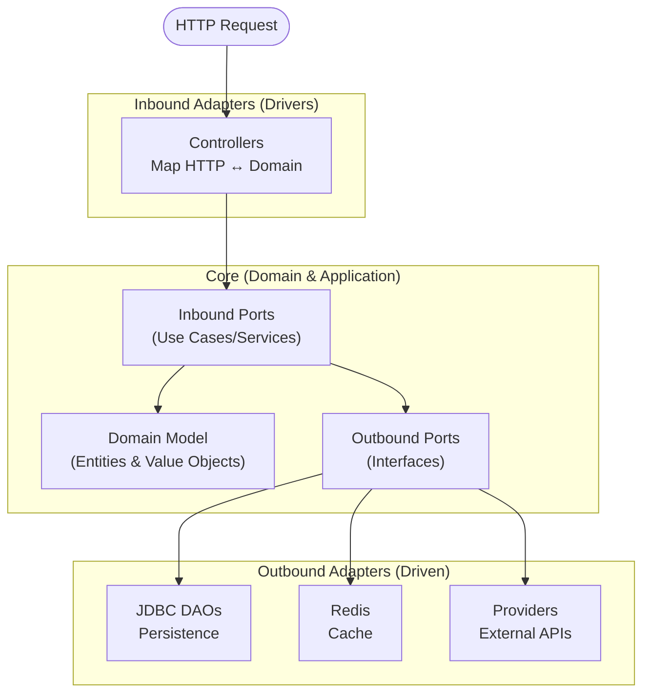

# Architecture Guide — Smart Home API

## Philosophy: Pragmatic Hexagonal Architecture
The project follows a Hexagonal Architecture (Ports and Adapters) with the goal of completely isolating the **core business logic** from infrastructure concerns (databases, HTTP frameworks, external APIs).

The domain layer has zero knowledge of Spring or JDBC; it depends only on pure Kotlin and the [Arrow](https://arrow-kt.io/) library.

---

## Layer Overview (Inbound & Outbound)



---

## Module Structure

Architectural boundaries are enforced at **compile time** by four Gradle modules with a strict unidirectional dependency graph:

| Module | Responsibility | Depends on |
|---|---|---|
| `:core` | Domain entities, value objects, failure types, use case interfaces and service implementations | nothing (pure Kotlin + Arrow) |
| `:persistence` | JDBC adapters, Redis cache adapters, DB entities | `:core` |
| `:providers` | External API clients (Netatmo, SwitchBot) | `:core` |
| `:app` | Spring Boot wiring, controllers, schedulers, security | `:core`, `:persistence`, `:providers` |

No reverse dependencies are permitted. `:core` cannot reference `:persistence`, `:providers`, or `:app` — the compiler enforces this, not convention.

---

## 1. Inbound Ports & Adapters (Driving Side)

### Inbound Ports (Use Cases)
Define the system's capabilities exposed to the outside world.
- **Responsibility:** Orchestrating business logic and outbound ports.
- **Rules:**
  - Must be behavior-centric and **task-specific** (one interface = one use case, e.g., `CreateAreaUseCase`, `RegisterDeviceUseCase`). Named examples like `HeatingAreasService` are legacy names being migrated.
  - The single method on each use case interface **must be named `execute()`** — never repeat the use case name (e.g., `CreateAreaUseCase.execute(...)`, not `CreateAreaUseCase.createArea(...)`).
  - Must return functional types (`Either`). Must accept only primitive types, standard library types, or specific DTOs defined inside the Core.
  - Live in `core/application/ports/inbounds/`.
- **Implementation (ISP/SRP):** Each use case interface must be implemented by its **own dedicated service class** (e.g., `CreateAreaService implements CreateAreaUseCase`). A single service class must **not** implement multiple use case interfaces. Service implementations live in `core/application/usecases/`.
- **Spring coupling in `:core`:** Service implementation classes carry `@Service` — the only Spring annotation permitted in `:core`. This makes them discoverable by Spring's component scan without explicit `@Bean` declarations. The domain layer (`core/domain/`) remains completely Spring-free. No other Spring annotation (`@Component`, `@Autowired`, `@Transactional`, etc.) is allowed in `:core`.

### Inbound Adapters (Controllers)
Infrastructure components that trigger the Inbound Ports.
- **Responsibility:** Deserializing HTTP bodies (JSON/HTTP Requests), mapping them to Domain Commands/Queries, delegating to services/ports, and mapping `Either` results to the appropriate HTTP response (e.g., `ResponseEntity`).
- **Rules:** Contain **no business logic**. They translate; they do not decide. Only controllers are allowed to depend on Spring Web.

---

## 2. Outbound Ports & Adapters (Driven Side)

### Outbound Ports (Interfaces)
Interfaces defined in the Core used by the domain to communicate with the external world (Databases, Third-party APIs).
- **Examples:** `AreasRepository`, `DevicesProvider`, `UnitOfWork`.
- **Rules:** Must only accept and return Domain Entities, Value Objects, or primitive types. Must not throw technical exceptions; use monadic types like `Either` to explicitly declare expected domain errors.

### Outbound Adapters (Persistence & API)
Technological implementations of the Outbound Ports.
- **Persistence:** We use **JdbcTemplate / Spring Data JDBC**. Implementations live in `persistence/jdbc/adapters/` and should ideally be `internal` to prevent direct coupling.
- **Cache:** Redis is used as a read-through cache for data retrieved from external providers. Cache adapters live in `persistence/cache/adapters/` and implement the same outbound port interfaces as the JDBC adapters, so the core never knows whether it is talking to the database or the cache.
- **Mapping:** Must translate between Domain Entities and Infrastructure Models (e.g., Database Rows) before saving or retrieving.
- **Exception Boundary:** Must catch infrastructure/technical exceptions (e.g., `DataAccessException`, `RestClientException`) and map them to the expected Domain Errors (e.g., `Left(AreaRepositoryError)`).

---

## 3. Core Domain Rules

### Error Handling — `Either` over Exceptions
Every operation that can fail returns `Either<DomainError, Success>`.
- Exceptions are **never** allowed to propagate into the service or domain layers. They are caught at infrastructure boundaries and converted into typed errors (sealed interfaces organized by domain concern, like `AreaCreationFailure`).

#### Two kinds of failure interfaces in `:core`
Not all failure interfaces in `:core` are `sealed`, and this is intentional:

- **Use case failure contracts** (`sealed interface`) — one per use case operation (e.g. `DeviceFetchFailure`, `AreaCreationFailure`). Sealed so that callers can write exhaustive `when` expressions and the compiler enforces completeness. Cannot be implemented outside `:core`.
- **Outbound port failure contracts** (`interface`) — failure types that belong to a device/sensor port (e.g. `SensorReadingsFailure`, `ActuatorOperationFailure`). Deliberately non-sealed because outbound adapters in other modules (e.g. `:providers`) must be able to implement them. Callers handle these generically; the module dependency boundary prevents provider-specific subtypes from being referenced outside `:providers`.

### Value Objects
Never use raw `Double` or `Float` for domain quantities. Use **inline value classes**:
- `Temperature`, `Percentage`, `RelativeHumidity` (based on `BigDecimal` with `HALF_UP` rounding).

### Domain Model Composition
Domain entities prefer Kotlin delegation (`by`) over deep inheritance:
```kotlin
class HeatableAreaImpl(mcArea: MonitoredClimateArea, ...) 
    : HeatableArea, MonitoredClimateArea by mcArea
```

---

## 4. Unit of Work Pattern
When a service operation requires multiple writes that must succeed or fail together, it uses the `UnitOfWork` port defined in the domain layer.
The adapter (`SpringUnitOfWork`) implements transactionality via Spring's `TransactionTemplate` in the infrastructure layer.

This keeps the domain completely clean of `@Transactional` annotations.

---

## Do's and Don'ts

### DO
- **DO** add KDoc to every public method on inbound port interfaces and public service methods whose contract is non-obvious (parameters with side-effects, default values with domain meaning, non-trivial return types). When moving a method from one file to another, port its KDoc verbatim.
- **DO** return `Either<DomainError, T>` from every operation that can fail.
- **DO** use `UnitOfWork.execute {}` when an operation performs two or more writes that must be atomic.
- **DO** catch all infrastructure exceptions inside Outbound Adapters and convert them to typed domain failures.
- **DO** use value objects (`Temperature`, `Percentage`, etc.) for domain quantities.
- **DO** use Arrow operators (`flatMap`, `map`, `recover`, or `either { }` blocks with `bind()`) to chain `Either` results.

### DON'T
- **DON'T** annotate core service classes (`core/application/usecases/`) with `@Transactional`. Transaction boundaries in the core belong exclusively to `UnitOfWork`. Outbound adapters (`persistence/`) may use `@Transactional` for self-contained atomic operations, but whenever a **service-level operation** must coordinate writes across multiple repositories atomically, it must use `UnitOfWork.execute {}` instead.
- **DON'T** let exceptions propagate beyond the Adapter layer.
- **DON'T** put business logic in controllers (Inbound Adapters).
- **DON'T** use `Either.getOrElse` or force-unwrap results in the service layer to avoid handling errors.
- **DON'T** name the method on a use case interface after the use case itself — always use `execute()`.
- **DON'T** let a single service class implement more than one use case interface.
- **DON'T** use the generic `Failure` type as the `Left` of a use case's `Either` — define a use-case-specific `sealed interface` (e.g. `GetHomeDashboardFailure`) so callers get an exhaustive and meaningful `when`.
