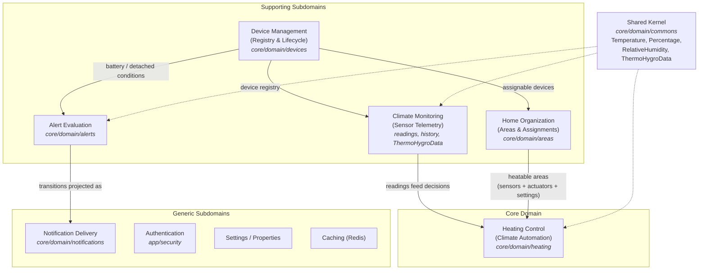

# DDD Subdomain Analysis — Smart Home API

## Scope and premise

Subdomains live in the **problem space**: they are the areas of the problem "managing a domestic
smart home with a climate focus", independently of how the code is organized. This codebase is
structured by hexagonal layers (ports / use cases / domain), not by subdomain, but the packages
under `core/domain/` (`heating`, `devices`, `areas`, `alerts`, `notifications`, `commons`) map
the subdomain landscape quite faithfully.

Five significant subdomains are identified, plus the generic ones at the edges.

---

## Subdomain map



External provider integration (SwitchBot, Netatmo — the `:providers` module) is deliberately
**not** on this map: it is not a subdomain but infrastructure of Device Management and Climate
Monitoring, acting as an anticorruption layer (Ktor adapters implementing core outbound ports).

---

## 1. Heating Control (Climate Automation) — **Core Domain**

The differentiating heart of the system, and the code confirms it: it is the subdomain with the
richest and most protected domain logic.

- `core/domain/heating/`: `HeatingDecision`, `HeaterCommand`, `HeatableAreaSnapshot`,
  `HeatingEvaluationReport`, `SharedHeatingStrategy` (`ECONOMY` / `COMFORT`)
- `EvaluateHeatingStateService`, `HeatingStrategySelector`, per-area heating schedules
  (CRUD + evaluation)
- It is the only place where the system **decides** rather than records or reports: it takes
  immutable snapshots (sensor readings + schedule + strategy) and produces commands towards
  the actuators.

Evidence of core status:

- Covered by **property-based testing** and **mutation testing** — the investment is in
  correctness, not just coverage.
- The domain model is kept pure, with I/O pushed into the application layer
  (`HeatableAreaSnapshot`s are built by device drivers in `EvaluateHeatingStateService`,
  never by the domain — see `ARCHITECTURE.md`).
- No off-the-shelf product solves "shared multi-area heating with pluggable strategies":
  this is exactly where the project's value lies.

## 2. Climate Monitoring (Sensor Telemetry) — **Supporting**

- `FetchSensorReadingsService`, `SnapshotSensorHistoryService`, the polling schedulers,
  `SensorsCurrentReadingsRepository` / `SensorsHistoryDataRepository`
- Non-trivial value objects: `Temperature`, `RelativeHumidity`, `AbsoluteHumidity`,
  `ThermoHygroData`

It exists to **feed** the core: without readings there is no heating decision. It has rules of
its own (absolute-humidity computation, historical snapshots) but it is not the differentiator —
it is data acquisition and retention. A classic supporting subdomain: built in-house because the
data model is ours, but not where the game is won.

## 3. Device Management (Registry & Lifecycle) — **Supporting**

- `core/domain/devices/` + [`docs/domain/DEVICES.md`](domain/DEVICES.md): the
  `PAIRED ⇄ DETACHED` lifecycle, the natural key `(provider, deviceProviderId)`,
  snapshot-driven synchronization, `DeviceModelCatalog` with catalog-derived features
- A genuine domain state machine with documented design decisions (provider failure →
  `DETACHED`, devices are never deleted).

Its reason to exist is providing the core and the monitoring subdomain with a reliable registry
of sensors and actuators. Boundary note: **provider integration** (the Ktor clients for
SwitchBot / Netatmo in `:providers`) is not a subdomain of its own — it is infrastructure of
this subdomain, correctly modeled as an anticorruption layer (providers implement core ports).

## 4. Home Organization (Areas & Assignments) — **Supporting**

- `core/domain/areas/`: `Area`, `AreaTemperatureSetting`, the `isIndoor` flag,
  sensor/actuator assignments
- The **spatial** model of the home: it gives the core the notion of a "heatable area"
  (area + sensors + actuators + temperature settings).

Whether this is an autonomous subdomain or part of Heating is debatable; it is kept separate
here because areas also serve monitoring and the dashboard, not only heating. It is the weakest
candidate of the five: if the project were reduced to heating alone, it would collapse into the
core domain as part of its language.

## 5. Alerting & Notifications — **Supporting + Generic (split)**

The code itself separates the two halves (`domain/alerts` vs `domain/notifications`), and the
DDD classification differs accordingly:

- **Alert evaluation** — *Supporting*. `AlertStateMachine` / `evaluateAlert`, `AlertTarget`,
  the idempotent `OPEN` / `RESOLVED` lifecycle. The evaluated conditions (`BATTERY_LOW`,
  `DEVICE_DETACHED`) are bound to the device domain.
- **Notification delivery** — *Generic*. `ReminderPolicy`, `RetentionPolicy`, reminder cadence.
  This is a fully generic problem that any alerting/paging product solves. ❗️ This is the place
  to stay minimal: every feature added here (retention, cadences, channels) is investment taken
  away from the core. Modeling notifications as a **projection** of alert state (source of
  truth = the alert on DB, see [`docs/domain/ALERTS.md`](domain/ALERTS.md)) is nonetheless the
  right call.

## Generic subdomains at the edges

They deserve no rich modeling — and correctly have none:

| Subdomain | Location | Type |
|---|---|---|
| Authentication (API key SHA-256) | `app/security` | Generic |
| Settings / Properties (key-value) | `PropertyRepository`, `UpsertProperty*` use cases | Generic |
| Caching | Redis adapters in `:persistence` | Generic (purely technical) |

The **`/home` dashboard + SSE stream** is not counted as a subdomain: it is a read-model / BFF
concern (it lives in `application/readmodels`, never in `core/domain` — ArchUnit-enforced).
That is solution space, not problem space.

---

## Summary

```
Core:        Heating Control
Supporting:  Climate Monitoring, Device Management, Home Organization, Alert Evaluation
Generic:     Notification Delivery, Authentication, Settings, Caching
```

`core/domain/commons` (`Temperature`, `ThermoHygroData`, `Percentage`, ...) acts as a de-facto
**shared kernel** between Heating, Monitoring and Alerting — small and made of value objects
only, hence healthy.

## Architectural observation ❗️

`:core` is packaged **by subdomain** across the whole application layer: inbound ports
(`application/ports/inbounds/{alerts,areas,devices,heating,home,notifications,sensors,settings}`),
their service implementations (`application/usecases/<subdomain>/`, same-named subpackage as the
interface each service implements) and the outbound ports (`application/ports/outbounds/...`)
follow the same partition — with two asymmetries on the outbound side: four cross-cutting ports
(`Cache`, `RandomGenerator`, `TimeProvider`, `UnitOfWork`) stay loose at the top level, and there
is no `heating` subpackage. Only the inbound side bans loose top-level interfaces. This makes the
subdomains explicit bounded contexts inside the monolith and is the near-zero-cost precursor of a
possible future extraction; ArchUnit enforces the domain dependency matrix, and a rule pairing
each use case package with its subdomain is a possible follow-up. Known debt for that rule:
`usecases/home` reads the heating property keys from the companions of `usecases/heating` service
classes (`EvaluateHeatingStateService.HEATING_ENABLED_KEY`,
`HeatingStrategySelector.HEATING_STRATEGY_KEY`) — a cross-subdomain service→service dependency to
relocate (or explicitly exempt) before that rule lands.
