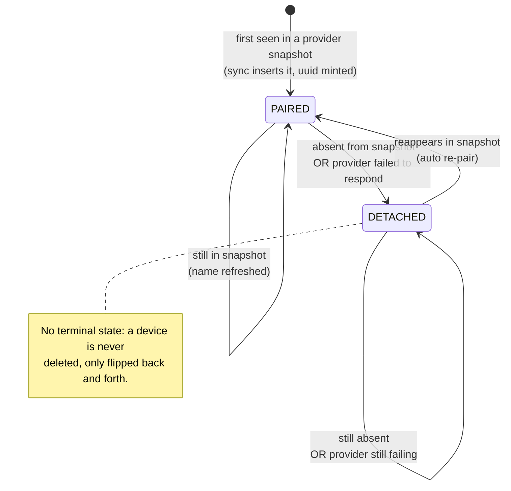

# Device Domain Model

## Overview

A `Device` is a physical smart-home appliance registered through an external provider (e.g. SwitchBot, Netatmo).
It is identified within the system by a surrogate `uuid` generated at creation time, and uniquely identified
at the provider level by the composite natural key `(provider, deviceProviderId)`.

The DB enforces this natural key via a unique constraint on `(provider, provider_id)`.

### How a device comes into existence

A device is **never created manually**: there is no registration endpoint and no user-facing "add device"
action. Devices are **discovered automatically** from the providers. The only producer of devices is the
synchronization cycle (`RefreshDevicesService`): when a provider reports a device whose natural key
`(provider, deviceProviderId)` is not yet persisted, the system mints a surrogate `uuid` and inserts it with
status `PAIRED`. See [Synchronization Flow](#synchronization-flow).

Symmetrically, a device is **never deleted**. The persistence port (`DevicesRepository`) exposes only
`create` and `update` — there is no `delete`. A device that disappears from its provider is flipped to
`DETACHED`, not removed (see lifecycle below). ❗️ This means detached devices accumulate indefinitely; there
is currently no purge/retirement path. This is an open design point, not an oversight to rely on.

---

## Device Lifecycle

A device's life is driven **entirely by provider snapshots** observed during synchronization. The `uuid` and
the natural key are immutable for the device's whole life; the only mutable lifecycle attribute is
`DeviceStatus`, which reflects the device's **last known reachability** — a reversible snapshot, not a
permanent domain event.

| Status     | Meaning |
|------------|---------|
| `PAIRED`   | The provider included this device in its latest snapshot. The device is reachable. |
| `DETACHED` | The device was absent from the provider's latest snapshot, **or the provider itself failed to respond**. The device is temporarily unreachable. |

### Key design decision: provider failure → DETACHED

If a provider fails during synchronization, its devices are treated as unreachable and marked `DETACHED`.
This is intentional: the system always reflects the last confirmed state. A transient provider outage
will resolve itself on the next successful sync cycle, at which point all re-appearing devices are
automatically re-paired (`DETACHED` → `PAIRED`).

This makes `DETACHED` semantically equivalent to **OFFLINE** — a temporary, reversible condition —
rather than a permanent "removed from provider registry" state.

---

## Synchronization Flow

Triggered by `POST /devices/synchronizations` (see [devices API](../api/devices.md)).

For each registered provider:
1. Fetch the current device snapshot (`DevicesProvider.getAllDevices()`).
2. If the provider fails, its devices become `DETACHED` (treated as unreachable).
3. Compare the snapshot against persisted devices using the natural key `(provider, deviceProviderId)`.

| Outcome       | Condition | Action |
|---------------|-----------|--------|
| **New**       | Device in snapshot, not in DB for that provider | Persist with status `PAIRED` |
| **Updated**   | Device in snapshot and in DB for that provider | Refresh `name` and status → `PAIRED` |
| **Detached**  | Device in DB for that provider, absent from snapshot | Update status → `DETACHED` |

The operation is **best-effort**: a failure on a single device (e.g. a DB insert error) does not abort
the synchronization. The remaining devices are processed independently.

---

## Who uses a Device, and how

Synchronization is the only **producer**. Everything else is a **consumer** of persisted devices. A consumer
that needs to talk to the physical device does **not** use the `Device` record directly: it rebuilds a live
`DeviceDriver` via the matching `ProviderDevicesFactory` (keyed by `provider`) and then exercises the
driver's *capabilities* (`Sensor`, `BatteryPowered`, `Inspectable`, …). The persisted `features`
(`SENSOR` / `ACTUATOR`) gate which capability is relevant.

| Consumer | Trigger | Uses the device for |
|----------|---------|---------------------|
| `RefreshDevicesService` | `POST /devices/synchronizations` (manual) | **Producer** — create / update status |
| `FetchSensorReadingsService` | `DevicesDataFetchScheduler`, cron every minute | Builds a driver per device; for `SENSOR` + `Sensor` drivers reads measurements; for `BatteryPowered` drivers stores the battery level; then publishes a home-state refresh |
| `SnapshotSensorHistoryUseCase` | `DevicesDataHistoryScheduler`, cron every 15 min | Snapshots current sensor readings into history |
| `GetDevicesService` | `GET /devices` | Lean list, filterable by `provider` / `status` / `feature` |
| `GetDeviceService` | `GET /devices/{uuid}` | Full `DeviceAggregate`: base fields + area assignments + cached `batteryLevel` |
| `InspectDeviceService` | `GET /devices/{uuid}/diagnostics` | Realtime provider truth via the `Inspectable` capability (see below) |

### Relationships held by the aggregate

The lean `Device` is just the device's own fields. The `DeviceAggregate` (returned by `GET /devices/{uuid}`)
adds the relationships our model holds:

- **Area assignments** (`DeviceAreaAssignment`) — a device participates in an area under a `role`
  (`SENSOR` / `ACTUATOR`). This is how a device becomes usable by area-scoped features.
- **Battery level** — last value cached by the readings fetch cycle, not part of the device identity.

Future links (heating schedules, actuator state, richer sensor history) attach here as new aggregate fields,
keeping the device list lean.

---

## Diagnostics Passthrough (provider's truth)

During synchronization the system **normalizes** provider data at the adapter boundary
(`DevicesProvider.getAllDevices()` → `ProviderDeviceData`) and discards everything it does not model.
The diagnostics passthrough exposes the opposite: the **provider's truth**, the full unfiltered payload a
provider holds about a single device, in realtime.

See [`GET /devices/{uuid}/diagnostics`](../api/devices.md#get-devicesuuiddiagnostics). It is the sibling
of `GET /devices/{uuid}` (our persisted *aggregate*); diagnostics is realtime-only — **never persisted nor
cached** — and intentionally surfaces provider failures rather than masking them.

### Design

- **Diagnostics is a device capability, not a provider-wide port.** A device driver opts in by implementing
  the `Inspectable` capability (`inspect(): Either<DevicesProviderFailure, String>`), sitting next to
  `fetchReadings()` / `getActuatorStatus()` — "ask *this* device about itself, now". This is distinct (ISP)
  from the sync snapshot.
- **Routing reuses `ProviderDevicesFactory`.** `InspectDeviceService` resolves the persisted device, builds
  its driver via the matching factory, and calls `inspect()` when the driver is `Inspectable`. A driver that
  is not `Inspectable` (e.g. the SwitchBot hub) yields `501 Not Implemented` — support is per device type,
  not per provider.
- **Raw `String`, not a parsed tree.** The capability returns the literal provider body, keeping the core
  free of any JSON library and avoiding a parse → re-serialize round trip that could reorder keys or drop
  fields. The controller writes it through with `Content-Type: application/json`.
- **Per-provider source.** Each driver decides which provider call(s) expose the device's realtime truth:
  - **SwitchBot** (`SwitchBotMeter`) → `GET /devices/{id}/status`, body passed through byte-for-byte.
  - **Netatmo** (`NetatmoSmarther`) → home status, from which the driver extracts **its own room** (by
    `roomId`). Single-thermostat-per-home is assumed today, consistent with `fetchReadings()`; handling
    multiple devices per room is deferred.
